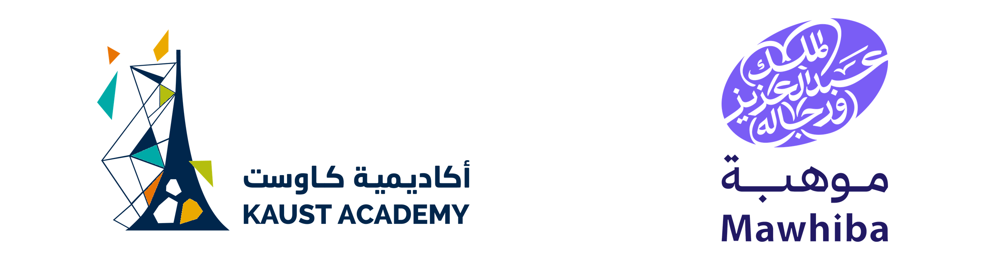

# Olympiad 2027

<picture>
  <source media="(prefers-color-scheme: dark)" srcset="L1/assets/img/banner-dark.png">
  
</picture>

Training material for the KAUST Academy & Mawhiba AI Olympiad 2027 programme. Each level lives in
its own folder with its own schedule, slides, labs and website.

| Level | Material | Website |
|---|---|---|
| Level 1 (Beginners) | [`L1/`](L1/) | https://kaust-academy.github.io/Olympiad2027/L1/ |
| Level 2 | `L2/` (material to come) | to come |

Recording and uploading lectures online is not permitted.
